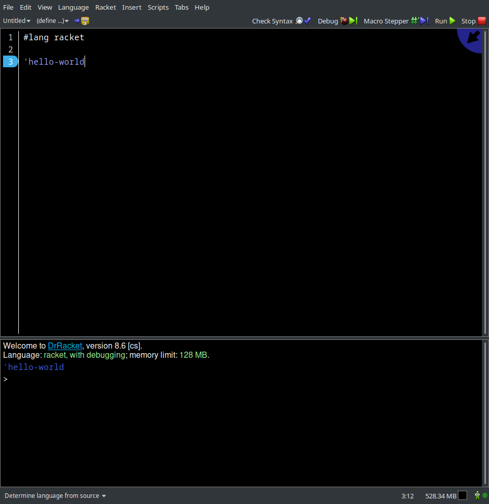

# Знакомство с Racket и DrRacket
Сперва стоит ответить на два вопроса - почему нельзя обойтись одним только Python'ом и почему Racket, почему
не какой-нибудь другой функциональный язык, например чисто функциональный Haskell или более близкий к Python язык Scala ~~(ИМХО)~~?
Отвечая на первый вопрос скажу что вполне можно было обойтись одним Python'ом, но по личному опыту
писать в функциональном стиле на нем не особо приятно. Это будет заметно при сравнении различных
сниппетов кода ниже. Отвечая на второй вопрос могу сказать что Racket, во-первых, довольно прост в своей
основе, во-вторых, использование Scheme (Racket - диалект Scheme) в учебных целях
уже считается некой традицией. В качестве примера приведу следующие сниппеты:
```python
# python
def sum(n1, n2):
    return n1 + n2
```
```scala
; racket
(define (sum n1 n2)
    (+ n1 n2))
```
```haskell
-- haskell
sum :: Int -> Int -> Int
sum = (+)
```
```scala
// scala
def sum(n1: Int, n2: Int): Int = n1 + n2
```
Надеюсь я ответил на эти вопросы.

---
Прежде чем приступить к обсуждению всех вышеперечисленных интересностей, необходимо
определится где мы будем писать код на Racket (я рассчитываю что Python у вас уже установлен)). Есть два ~~стула~~ способа:
1. Веб-ресурс [OneCompiler](https://onecompiler.com/racket)
2. Или локально

Я настоятельно рекомендую все делать локально, потому что так надежнее, но решать где вы будете писать код все равно не мне.
Поэтому если вы решили всё делать онлайн, то можете приступать к следующему уроку. 
<br>
<br>
Чтобы начать работу локально нам необходимо установить сам язык Racket и среду разработки DrRacket (они идут совместной поставкой).
Для этого перейдем на [официальный сайт](https://download.racket-lang.org/).
Выбирайте нужную платформу если она не выбралась автоматически и скачивайте инсталлятор. Если возникли трудности
со скачиванием, то пробуйте через зеркала (mirror). Процесс установки довольно стандартен и трудностей вызывать не должен.
После завершения установки следует проверить ее успешность, для этого откроем консоль и введем `racket`.
После чего запустится [REPL (Read-Eval-Print-Loop)](https://ru.wikipedia.org/wiki/REPL). Аналогичный для Python
можно запустить командой `python` или `python3`. Введите `'hello-world`, REPL вернет вам это же значение. Вот мы и 
написали первую программу на Racket!

Теперь давайте разберемся с DrRacket. Его можно запустить через консоль командой `drracket` или просто через
соответсвующую иконку. Когда DrRacket загрузится вы увидите что-то такое:



Сосредоточимся сперва на основном окне. На скриншоте выше запечатлены две строки ~~(пустую не считаем)~~. 
В первой указывается специальная директива говорящая и нам и самому Racket какой язык мы хотим использовать.
Среда DrRacket предоставляет в ваше распоряжение несколько разных языков, но все они нам не интересны. Мы будем
пользоваться только стандартным Racket (или некоторыми его расширениями, что будет указано), поэтому дальше 
`#lang racket` будет опускаться. Такая директива используется только когда мы работаем непосредственно в 
DrRacket или с файлами программ, в REPL нам ничего указывать не нужно, но можно. Также обратите внимание на нижний
левый угол где написано `Determine language from source`. Если у вас там написано нечто иное, то нажмите на эту надпись
и выберите то что у меня.

Чтобы запустить программу, нажмите `Run` в правом верхнем углу. Программа отработает последовательно, сверху-вниз,
а результат выведется в нижней части окна предназначенной под REPl.

Чтобы сохранить результат своей работы, нажмите `Ctrl-C` или выберите `File->Save Definitions`.
По изучайте интерфейс, посмотрите какие есть настройки, что делают те или иные кнопки. 
Если у вас туго с английским, то можете выбрать `Help->Работать с русским интерфейсом DrRacket`, но
если в дальнейшем я буду обращаться к каким либо элементам интерфейса, то буду приводить названия
на английском языке, так что имейте это в виду.

Если вы успешно дошли до этого момента, то могу вас поздравить - вы готовы учиться ФП!

[содержание](../../README.md)
<br>
[дальше](../l_2/README.md)