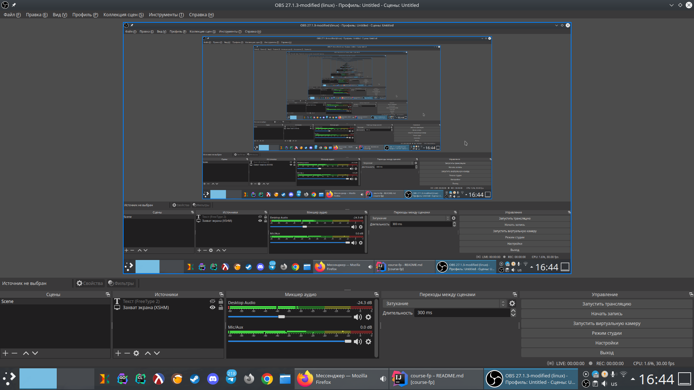

# Знакомство с рекурсией
Наверняка когда вы слышите слово "рекурсия" у вас всплывает в голове нечто такое:



Нечто до бесконечности вложенное само в себя. И это равнозначно итерации с которой вы уже должны быть 
знакомы. Итерирование я бы представил зацикленной гифкой. Давайте теперь посмотрим как это выглядит в коде:

```python
# python - итерирование
i = 0
while True:
    print(i)
    i += 1
```
```racket
; racket - итерирование
(let ([i 0])
  (for ([loop (in-naturals)])
    (displayln i)
    (set! i (+ i 1))))
```

Подобное поведение можно представить и через рекурсивные функции, т.е. функции определяемые через 
самих себя:

```python
# python - рекурсия
# не запускайте
i = 0
def infInc():
    global i
    print(i)
    i += 1
    infInc()
infInc()
```

```racket
; racket - рекурсия
; не запускайте
(define Y (λ (b) ((λ (f) (b (λ (x) ((f f) x))))
                  (λ (f) (b (λ (x) ((f f) x)))))))
(let* ([i 0])
  (Y (λ (inf-inc)
       (begin
         (displayln i)
         (set! i (+ i 1))
         (Y inf-inc)))))
```

Этот код выполняет ровно ту же самую работу, что и примеры с циклами выше. Только здесь пришлось
прибегнуть к особой функциональной магии под названием [комбинаторы](https://ru.wikipedia.org/wiki/%D0%9A%D0%BE%D0%BC%D0%B1%D0%B8%D0%BD%D0%B0%D1%82%D0%BE%D1%80%D0%BD%D0%B0%D1%8F_%D0%BB%D0%BE%D0%B3%D0%B8%D0%BA%D0%B0), 
~~хотя наверное можно было и проще ¯\\_(ツ)_/¯~~, в любом случае пока не забивайте этим голову. Вместо итераций цикла
мы имеем вызов функции. Все эти примеры будут выполняться бесконечно (на что намекает название функций),
что зачастую бесполезно (если конечно вы не пишите сервера, GUI-фреймворк, игровой движок или что-то в этом духе),
поэтому и цикл, и рекурсию можно прервать. Давайте разберем наиболее частые примеры использования 
циклов с эквивалентными примерами переписанными через рекурсию: 

```python
# python - обход коллекции с помощью цикла
list = [1, 2, 3]
for i in list:
    print(i)
```
```racket
; racket - обход коллекции с помощью цикла
(define list '(1 2 3))
(for ([i list])
  (displayln i))
```
```python
# python - обход коллекции с помощью рекурсии
def printList(list):
    if list == []:
        return
    print(list[0])
    printList(list[1:])
printList([1, 2, 3])
```
```racket
; racket - обход коллекции с помощью рекурсии
(define list '(1 2 3))
(define (print-list list)
  (if (empty? list)
      '()
      (begin
        (displayln (car list))
        (print-list (cdr list)))))
(print-list list)
```
 