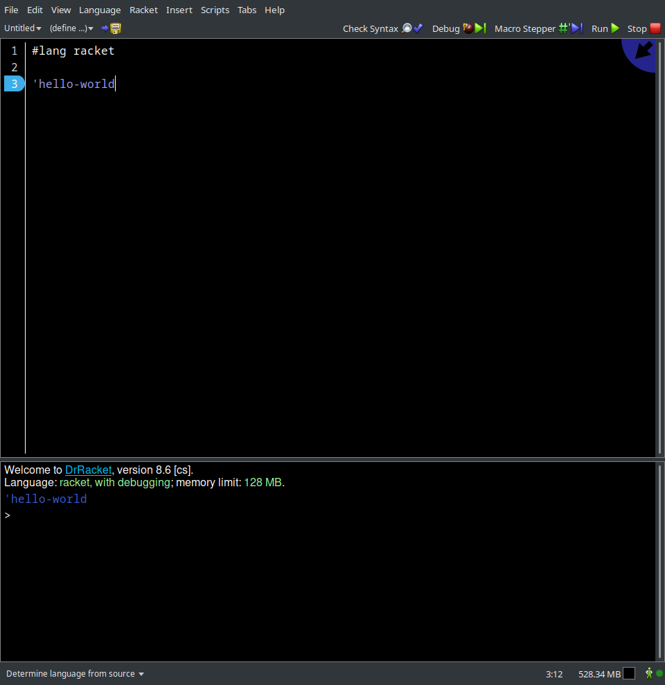

# Знакомство со Scala, JVM и IDE
Сперва стоит ответить на два вопроса - почему нельзя обойтись одним только Python'ом и почему Scala, почему
не какой-нибудь другой функциональный язык, например чисто функциональный Haskell или простой Clojure?
Отвечая на первый вопрос скажу что вполне можно было обойтись одним Python'ом, но по личному опыту
писать в функциональном стиле на нем не особо приятно. Это будет заметно при сравнении различных
сниппетов кода ниже. Отвечая на второй вопрос могу сказать что Scala, во-первых, более дружелюбен к
новичкам (на мой взгляд), во-вторых, базовым синтаксисом он напоминает Python, что тоже должно
положительно повлиять на усвоение материала. В качестве примера приведу следующие сниппеты:
```python
# python
def sum(n1, n2):
    return n1 + n2
```
```scala
// scala
def sum(n1: Int, n2: Int): Int = n1 + n2
```
```haskell
-- haskell
sum :: Int -> Int -> Int
sum = (+)
```
```clojure
; clojure
(defn sum [n1 n2]
      (+ n1 n2))
```
Надеюсь я ответил на эти вопросы. <br><br>

Прежде чем приступить к обсуждению всех вышеперечисленных интересностей, необходимо
определится где мы будем писать код на Scala (я рассчитываю что Python у вас уже установлен)). Есть два ~~стула~~ способа:
1. Веб-ресурс [scastie](https://scastie.scala-lang.org/)
2. или локально

Я настоятельно рекомендую все делать локально, потому что так надежнее. Например, пока я 
писал эти строки, я параллельно пытался проверить тривиальный hello world в scastie,
но он не заработал ¯\\_(ツ)_/¯. Но все же где и как вы будете писать код решать не мне.
<br>
<br>
Пару слов про работу локально. Так как Scala работает под [JVM (Java Virtual Machine)](https://ru.wikipedia.org/wiki/Java_Virtual_Machine), то вам
разумеется нужно будет установить и ее, причем в первую очередь. Существует две версии JVM - JRE (Java Runtime Environment) и JDK (Java Development Kit).
Первая зачастую ставиться на машине пользователя для запуска Java-приложений (в том числе и Scala-приложений), вторая необходима для разработки
этих самых приложений и при этом включает в свою поставку JRE, так что нам нужно просто установить JDK.
Для этого заходим на сайт [Oracle](https://www.oracle.com/java/technologies/downloads/) и выбираем нужный пункт. Подозреваю что
вы работаете на машине под управлением ОС Windows и потому советую скачивать инсталлятор выделенный на изображении ниже.



После установки рекомендую проверить переменные окружения. Для этого откройте проводник, правой кнопкой
мыши нажмите на "Мой компьютер", в выпадающем списке выберите "Свойства", в открывшемся окне найдите
кнопку "Дополнительные параметры системы", в появившемся окне найдите кнопку "Переменные среды", в появившемся окне
проверьте - существует ли такая переменная как $JAVA_HOME. Если она существует, то спокойно можете закрывать
эту тьму окон, если же ее нет, то создайте новую переменную, назовите ее JAVA_HOME и установите ей
в качестве значения путь до только что установленного нами JDK. Если все сделано правильно, то при
запуске в консоли команды:
```bash
java --version
```
вы должны будете увидеть что-то вроде:
```
openjdk 17.0.4 2022-07-19
OpenJDK Runtime Environment GraalVM CE 22.2.0 (build 17.0.4+8-jvmci-22.2-b06)
OpenJDK 64-Bit Server VM GraalVM CE 22.2.0 (build 17.0.4+8-jvmci-22.2-b06, mixed mode, sharing)
```
У вас скорее всего будет немного другое сообщение, но это не страшно, у меня немного специфичная версия
JDK, но сути это не меняет. В качестве дополнительного задания самым любопытным могу посоветовать
почитать про GraalVM.

Дальше нам необходимо установить сам язык Scala. Для этого перейдем на [официальный сайт](https://docs.scala-lang.org/ru/getting-started/index.html).
Там есть версия инструкции на русском языке, ее я и вставил в предыдущую ссылку. Следуйте простым указаниям.
Если вы успешно установили Scala с помощью Coursier`а, то у вас уже есть пакетный менеджер sbt.
Если вы устанавливали вручную, то в той же инструкции есть ссылка на то как вручную установить sbt.
Теперь давайте проверим что все работает, для этого выполним несколько команд:
```
kostya@vivobook:~$ sbt --version
sbt version in this project: 1.8.0
sbt script version: 1.8.0
kostya@vivobook:~$ sbt new scala/scala3.g8
...
name [Scala 3 Project Template]: hello-world

Template applied in /home/kostya/./hello-world

kostya@vivobook:~$ cd hello-world
kostya@vivobook:~$ sbt run
...
Hello world!
I was compiled by Scala 3. :)
[success] Total time: 26 s, completed 22 дек. 2022 г., 22:26:47
```
У вас скорее всего опять-таки все может выглядеть немного по другому, но главное, суть остается та же.
`kostya@vivobook:~$` - приветствие консоли, у вас вероятно будет `C:\users\user` или около того.
Многоточие - длинный, не интересный нам вывод программ. Также хочу отметить что в строке
`name [Scala 3 Project Template]: hello-world` `hello-world` вводится нами.

Дальше идет настройка вашего любимого редактора кода. Все в той же инструкции выше можно найти
указания на настройку самых разных редакторов. Если у вас нормальный компьютер, и >=8 ГБ оперативной
памяти, то можете ставить Intellij IDEA. Превосходный во всех отношениях, кроме потребления ресурсов
компьютера, продукт. Существует две версии - бесплатная, но урезанная по функционалу Community, и 
пригодная для профессиональной разработки на Java, Scala и других JVM языках Ultimate. Нам с головой
хватит бесплатной версии, но если есть желание, то можете приобрести разными путями Ultimate версию.
Есть несколько способов. Во-первых, можно заплатить денег. Во-вторых, у JetBrains есть программа
поддержки студентов, вы можете отправить им фото студенческого билета, а они пришлют ключ активации, 
подробнее о том как это сделать ищите в интернете. И есть третий способ, но я вам о нем не скажу)
После установки IDE установите также плагин для Scala, после этого вы сможете создавать
проекты сразу в IDE не прибегая к консоли. Также можете установить плагин для Python, или вообще скачать
PyCharm от тех же разработчиков, там точно такая же схема с версиями, как и у Intellij IDEA.

Если в итоге у вас все получилось, то могу вас поздравить - вы готовы учиться ФП!

[содержание](../../../../README.md)
<br>
[дальше](../l_2/README.md)