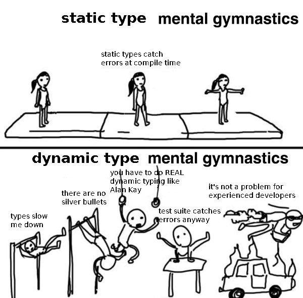

# Первые шаги - функции
Так как мы в данном курсе рассматриваем функциональное программирование, то думаю стоит начать
с того, на чем оно непосредственно основывается - с функций. Для чего предназначены функции?
Обычно с их помощью избавляются от дублирующего кода. Когда вы видите в коде 
несколько кусков делающих одно и то же, но с разными данными, то вы можете
абстрагироваться по этим данным сделав их параметрами функции и таким образом избавиться
от дублирования. Кто-то может спросить - а что плохого в дублировании? Отвечаю - дублирование делает код
более хрупким и ненадежным. Есть даже целый принцип в программировании под названием 
[DRY (Don't Repeat Yourself)](https://ru.wikipedia.org/wiki/Don%E2%80%99t_repeat_yourself). В качестве примера такой абстракции приведу следующий синтетический
сниппет:
```python
list1 = [1, 2, 3]
result1 = 0
for i in list1:
    result1 += i
    
list2 = [4, 5, 6]
result2 = 0
for i in list2:
    result2 += 1
```
Если вдруг мы захотим к примеру выводить каждое суммируемое число, то нам нужно будет
изменить два места:
```python
list1 = [1, 2, 3]
result1 = 0
for i in list1:
    print(i)
    result1 += i
    
list2 = [4, 5, 6]
result2 = 0
for i in list2:
    print(i)
    result2 += 1
```
А если таких мест в программе много, то можно легко ошибиться и забыть про одно из них, тогда
в вашем коде будет неприятная логическая ошибка. Чтобы избавиться от подобных потенциальных ошибок и
просто-напросто облегчить нам самим жизнь, мы создаем следующую функцию:
```python
def sum(list):
    result = 0
    for i in list:
        result += i
    return result
```
А теперь уберем из изначального варианта циклы и заменим их вызовом только что написанной функции `sum`:
```python
list1 = [1, 2, 3]
result1 = sum(list1)
    
list2 = [4, 5, 6]
result2 = sum(list2)
```
Теперь, чтобы добавить отладочный вывод, нам требуется изменить лишь одно место в программе:
```python
def sum(list):
    result = 0
    for i in list:
        print(i)
        result += i
    return result
```
---
Мы увидели как на практике использовать функции, теперь давайте немного разберемся с теорией.
Я не буду приводить грамматики описывающие синтаксис, вместо этого приведу
немного более наглядный, но достаточно абстрактный пример синтаксиса функций в Python:
```python
def f(param1, param2, ..., paramn):
    ...
    return result
```
Отсюда можно выделить следующие ключевые моменты:
- Всякая функция должна начинаться с ключевого слова `def`.
- Затем идет имя функции (в примере это `f`).
- После имени, в круглых скобках через запятую перечисляются параметры принимаемые функцией.
- `:`,
- после которого идет тело функции. Оно может содержать произвольный код на Python'е.
- Чтобы вернуть некоторый результат, требуется использовать конструкцию `return`

Функции в Python могут быть и сложнее чем то что описано выше, например могут использоваться
глобальные параметры (`global`), `*args, **kwargs`, аннотации типов, декораторы, async/await и пр. 
Но для нас сейчас это все несущественно. Теперь давайте сравним это со Scala:
```scala
def f(param1: T1, param2: T2, ..., paramn: Tn): R = expr
```
Где:
- Также используется ключевое слово `def` (хотя на самом деле, [можно и по другому](https://docs.scala-lang.org/ru/tour/basics.html), но для нас это не существенно).
- Имя функции и объявление ее параметров (сигнатура функции) объявлена также, но с обязательными аннотациями типов 
(Scala - [статически типизированный язык](https://habr.com/ru/post/308484/)). Также стоит отметить что мы указываем тип 
возвращаемого функцией значения - `R`.
- Вместо `:` используется `=` для разделения сигнатуры и тела функции.
- Отсутствует конструкция `return`, а в качестве возвращаемого значения используется последнее выражение

Чтобы лучше прочувствовать вкус Scala я приведу несколько более конкретный пример:
```python
# python
def sum(n):
    sum = 0
    for i in range(0, n+1):
        sum += i
    return sum
```
```scala
// scala
def sum(n: Int): Int =
  var sum = 0
  for i <- 0 to n do 
    sum = sum + i
  sum
```
Остальные различия: [объявления переменных](https://docs.scala-lang.org/ru/tour/basics.html), [синтаксис цикла](https://russianblogs.com/article/5047770782/) и комментарии.
Такой код получился при буквальном переводе с языка на язык, такое не приветствуется не только
в естественных языках. В дальнейшем мы будем постепенно изменять (рефакторить) эту функцию делая ее
более идиоматичной (подходящей для конкретного языка/подхода).

В одном из предыдущих уроков я рассказывал про анонимные функции, давайте вспомним как они пишутся в
Python:
```python
lambda param1, param2, ..., paramn: expr
```
Что мы видим здесь:
- Лямбда объявляется с помощью ключевого слова `lambda`,
- после которого идет список параметров,
- оканчивающийся `:`,
- за которым идет тело лямбды

Последний пункт является важным моментом, так как лямбды в Python ограничены, в них нельзя указывать произвольное 
кол-во выражений. Давайте теперь сравним со Scala:
```scala
(param1: T1, param2: T2, ..., paramn: Tn) => expr
```
Тут не используются ключевые слова для обозначения лямбды, мы просто сразу пишем обычную сигнатуру функции,
но без имени. Также тут не указывается тип возвращаемого значения. Сигнатуру и тело лямбды
разделяет `=>`. И в отличие от Python, в Scala можно написать например следующий код:
```scala
(x: Int) =>
  println(x * 10)
  x + 1
```
~~Правда в Python есть свои [приколы](https://buttondown.email/hillelwayne/archive/i-am-disappointed-by-dynamic-typing/), более могущественные, но и более вербозные~~

Есть также сокращенный синтаксис лямбд:
```scala
(_ * 2)
// или
((_: Int) * 2)
```
Такой синтаксис используется для простых лямбд в которых нам не нужно использовать параметры более
одного раза.

В заключении урока хочу напомнить что Python и Scala имеют разную типизацию, отчего вам может
быть непривычно и неудобно везде расставлять аннотации типов. По моему скромному мнению статическая
типизация хоть и бьет по рукам, но она полезней новичкам. Можно сказать что это дополнительный трос 
защищающий вас от падения в бездну. Приведу мою любимую картинку по этому поводу ~~пришлось залезть в запрещенный в РФ твиттер ради этого~~:



Также хочется сказать про такие вещи в Scala как [дженерики](https://habr.com/ru/company/vk/blog/461321/) и [Any](https://docs.scala-lang.org/ru/tour/unified-types.html):
```scala
// дженерики
def f[T, R](x1: T, x2: T): R = expr
```
Тут объявлена функция `f` с дженерик типами `[T, R]`. Как читать такой код? Я бы прочел так:
> Объявлена функция `f` с двумя дженерик типами `T` и `R` принимающая два параметра одного типа `T` - `x1` и `x2` 
> и возвращающая тип `R`

Такая функция накладывает некоторые ограничения на типы своих параметров. Т.е. мы не сможем
вызвать ее например следующим образом `f(1, 1.2)` или `f(1, "2")` так как это всё значения разных типов.
Если нам наплевать на тип принимаемого значения, то можно воспользоваться типом `Any`:
```scala
// Any
def f(x1: Any, x2: Any): Any = expr
```
Теперь мы сможем вызвать функцию со значениями любых типов. Но у всего есть своя цена, и в данном случае
мы не сможем сделать с `x1` и `x2` ничего что не предусматривается делать с типом `Any`. Т.е. я например не
смогу сложить эти параметры, так как операция сложения не определена для типа `Any`. Это нужно будет 
учитывать при работе как с типами, так и со Scala.

[содержание](../../../../README.md)
<br>
[дальше](../l_3/README.md)